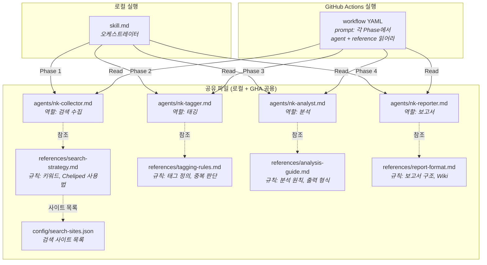
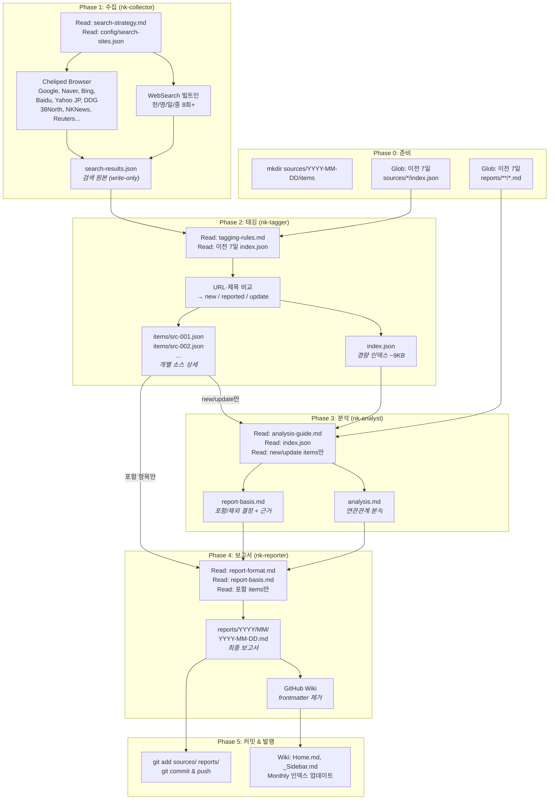
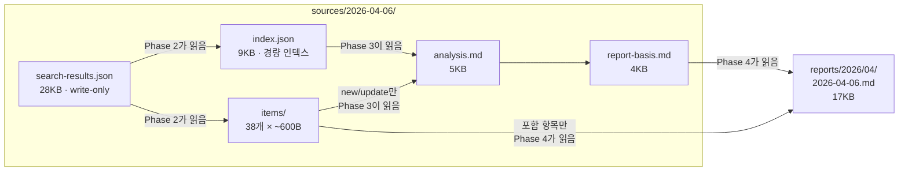
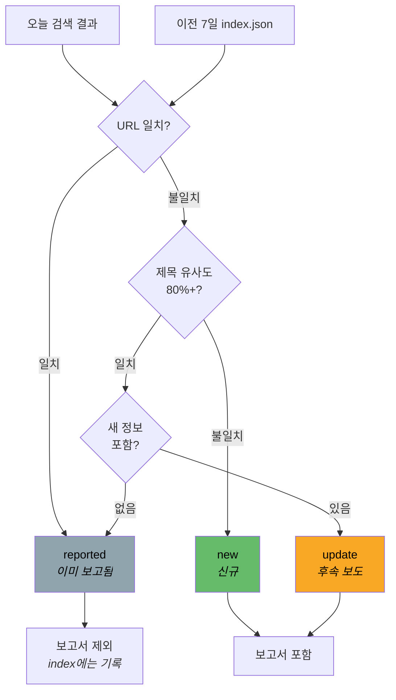
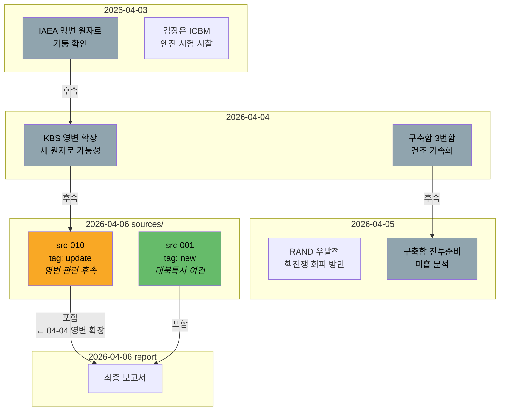

# North Korean Nuclear Activities Monitor

북한 핵활동에 대한 자동화된 일일 모니터링 및 보고서 생성 시스템.

GitHub Actions에서 Claude Code 에이전트가 매일 KST 08:00에 실행되어, 4단계 파이프라인(수집 → 태깅 → 분석 → 보고서)으로 추적 가능한 일일 보고서를 자동 생성합니다.

---

## 1. 에이전트 · 스킬 · 워크플로우 구조

이 시스템은 **에이전트**(누가), **스킬**(어떻게), **워크플로우**(언제·어디서)를 분리하여 구성합니다.
로컬과 GitHub Actions에서 **동일한 파일**을 사용하되, 실행 방식만 다릅니다.



### 에이전트 = "누가" (역할 정의)

각 Phase를 담당하는 에이전트의 **역할, 작업 원칙, 입출력, 에러 핸들링**을 정의합니다.
상세 규칙은 담지 않고, 참조 스킬 파일을 가리킵니다.

```
.claude/agents/
├── nk-collector.md   → "나는 검색 수집 전문가다. 상세 규칙은 search-strategy.md를 읽어라"
├── nk-tagger.md      → "나는 태깅 전문가다. 상세 규칙은 tagging-rules.md를 읽어라"
├── nk-analyst.md     → "나는 분석 전문가다. 상세 규칙은 analysis-guide.md를 읽어라"
└── nk-reporter.md    → "나는 보고서 전문가다. 상세 규칙은 report-format.md를 읽어라"
```

### 스킬 = "어떻게" (상세 규칙 + 오케스트레이션)

```
.claude/skills/nk-nuclear-report/
├── skill.md                        ← 오케스트레이터 (Phase 순서, 에러 핸들링)
└── references/                     ← 에이전트별 상세 규칙
    ├── search-strategy.md          ← 검색 키워드, Cheliped 사용법, 출력 스키마
    ├── tagging-rules.md            ← 태그 정의, 중복 판단 기준, index/items 스키마
    ├── analysis-guide.md           ← 분석 원칙, 중요도 기준, 출력 형식
    └── report-format.md            ← 보고서 구조, Wiki 발행 규칙
```

### 워크플로우 = "언제·어디서" (트리거 + 환경)

```
.github/workflows/daily-nk-nuclear-report.yml
├── 트리거: cron (KST 08:00) 또는 수동
├── 환경: ubuntu + Node.js + Cheliped Browser + Claude Code
└── 프롬프트: "각 Phase에서 agent 파일과 reference 파일을 Read하고 따라라"
```

### 실행 환경별 비교

| | 로컬 | GitHub Actions |
|---|---|---|
| **진입점** | `/nk-nuclear-report` (skill.md) | workflow YAML prompt |
| **에이전트** | 팀 멤버로 호출 가능 | Read로 역할 참조 |
| **스킬 references/** | 에이전트가 직접 Read | prompt 지시에 의해 Read |
| **config/search-sites.json** | 동일 | 동일 |
| **산출물** | 동일 | 동일 |

---

## 2. 파이프라인 데이터 흐름

4단계 파이프라인은 각 Phase의 산출물을 파일로 저장하여 전 과정을 추적할 수 있습니다.



---

## 3. 산출물 상세

각 Phase가 생성하는 파일과 다음 Phase에서의 사용 방식:



| Phase | 산출물 | 크기 | 다음 Phase에서 | 이전 날짜에서 |
|-------|--------|------|----------------|--------------|
| 1 | `search-results.json` | ~28KB | Phase 2가 읽음 | 읽지 않음 (write-only) |
| 2 | `index.json` | ~9KB | Phase 3이 읽음 | **이전 7일치 비교용으로 읽힘** |
| 2 | `items/src-XXX.json` | ~600B 각 | Phase 3, 4가 필요 항목만 | 읽지 않음 |
| 3 | `analysis.md` | ~5KB | Phase 4가 읽음 | 읽지 않음 |
| 3 | `report-basis.md` | ~4KB | Phase 4가 읽음 | 읽지 않음 |
| 4 | `YYYY-MM-DD.md` | ~17KB | Wiki 발행 | 이전 7일 보고서로 Phase 3에서 참조 |

### 토큰 효율 설계

```
이전 소스 비교 시:
  ✗ items/src-XXX.json 38개 × 7일 = 266 파일 읽기 (비효율)
  ✓ index.json × 7일 = 7 파일 읽기 (~63KB)

분석 시:
  ✗ 전체 38개 items 읽기
  ✓ new/update 태그만 (~12개) 선별 읽기
```

---

## 4. 태깅과 연관관계 추적

### 태깅 흐름



### 일별 연관관계 추적



---

## 5. 전체 디렉토리 구조

```
north-korean-nuclear-activities/
│
├── .claude/
│   ├── agents/                          # 에이전트 (역할 정의)
│   │   ├── nk-collector.md              #   Phase 1: 검색 수집
│   │   ├── nk-tagger.md                 #   Phase 2: 태깅
│   │   ├── nk-analyst.md                #   Phase 3: 분석
│   │   └── nk-reporter.md              #   Phase 4: 보고서
│   │
│   └── skills/nk-nuclear-report/        # 스킬
│       ├── skill.md                     #   오케스트레이터
│       └── references/                  #   에이전트별 상세 규칙
│           ├── search-strategy.md       #     검색 키워드, Cheliped 사용법
│           ├── tagging-rules.md         #     태그 정의, 중복 판단, 스키마
│           ├── analysis-guide.md        #     분석 원칙, 출력 형식
│           └── report-format.md         #     보고서 구조, Wiki 규칙
│
├── .github/workflows/
│   └── daily-nk-nuclear-report.yml      # GHA 워크플로우
│
├── config/
│   └── search-sites.json                # 검색 사이트 목록 (유일한 소스)
│
├── sources/                             # 파이프라인 중간 산출물
│   └── YYYY-MM-DD/
│       ├── search-results.json          #   Phase 1 산출물
│       ├── index.json                   #   Phase 2 산출물 (경량 인덱스)
│       ├── items/                       #   Phase 2 산출물 (개별 소스)
│       │   ├── src-001.json
│       │   └── ...
│       ├── analysis.md                  #   Phase 3 산출물
│       └── report-basis.md              #   Phase 3 산출물
│
├── reports/                             # 최종 보고서
│   └── YYYY/MM/
│       └── YYYY-MM-DD.md
│
├── CLAUDE.md                            # 프로젝트 규칙 (공통)
└── README.md
```

---

## 6. 수정 가이드

무엇을 바꾸고 싶은지에 따라 수정할 파일이 다릅니다:

| 변경 사항 | 수정 파일 |
|-----------|----------|
| 검색 사이트 추가/제거 | `config/search-sites.json` |
| 검색 키워드 변경 | `references/search-strategy.md` |
| 태깅 규칙 변경 | `references/tagging-rules.md` |
| 분석 기준 변경 | `references/analysis-guide.md` |
| 보고서 형식 변경 | `references/report-format.md` |
| 에이전트 역할 변경 | `agents/nk-*.md` |
| 파이프라인 순서 변경 | `skill.md` + workflow YAML |
| 실행 시간 변경 | workflow YAML (cron) |
| 프로젝트 공통 규칙 | `CLAUDE.md` |

---

## 7. 설정

### 필수 시크릿

| Secret | 설명 |
|--------|------|
| `CLAUDE_CODE_OAUTH_TOKEN` | Claude Code OAuth 토큰 |

### 설정 방법

1. GitHub repo → Settings → Secrets and variables → Actions
2. `CLAUDE_CODE_OAUTH_TOKEN` 시크릿 추가
3. Claude Code CLI에서 `/install-github-app` 실행하여 토큰 발급

### 수동 실행

Actions 탭 → "Daily NK Nuclear Activities Report" → "Run workflow"

특정 날짜: `target_date`에 `YYYY-MM-DD` 입력

---

## 8. 기술 스택

| 구성요소 | 기술 |
|----------|------|
| CI/CD | GitHub Actions |
| AI Agent | [Claude Code](https://claude.com/claude-code) via [claude-code-action](https://github.com/anthropics/claude-code-action) |
| 모델 | Claude Opus 4.6 |
| 웹검색 | WebSearch (빌트인) + [Cheliped Browser](https://github.com/tykimos/cheliped-browser) |
| Wiki | GitHub Wiki (자동 발행) |

## 라이선스

MIT License - [LICENSE](LICENSE) 참조
