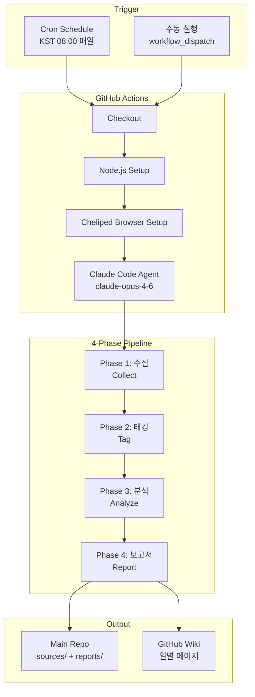
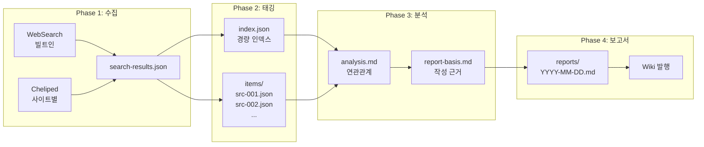
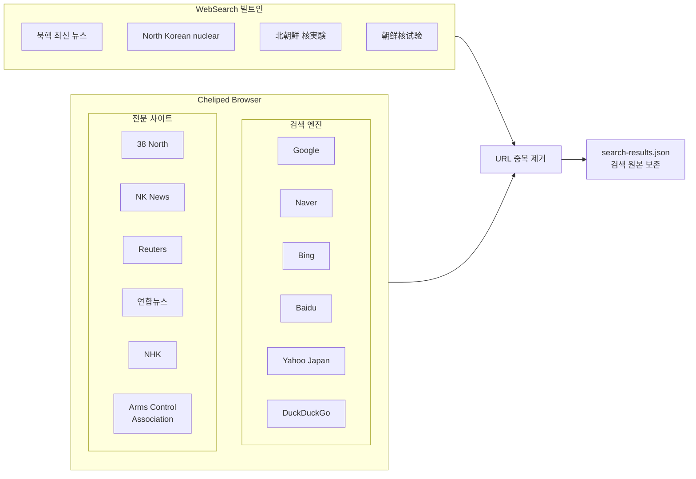
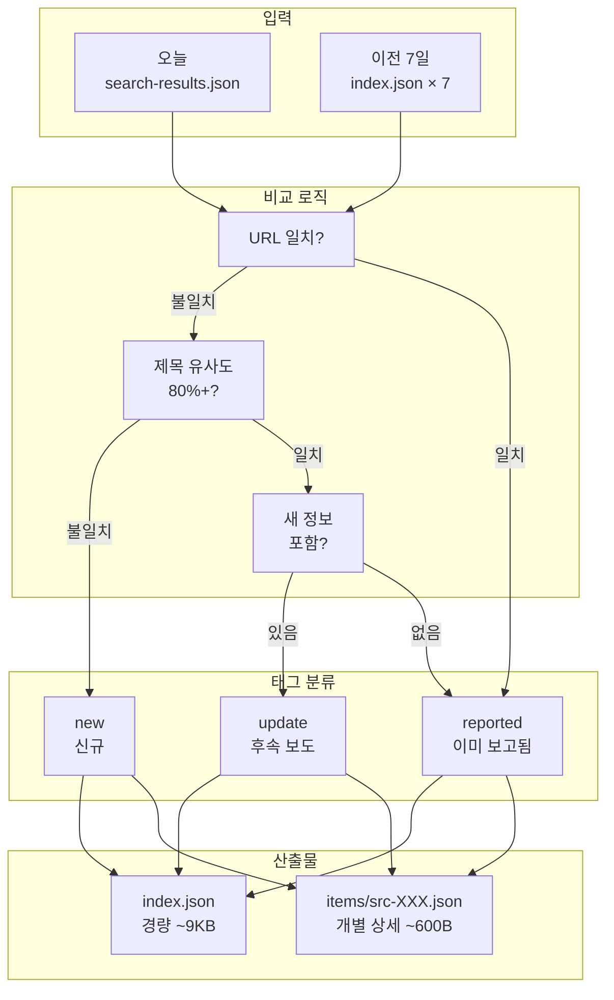
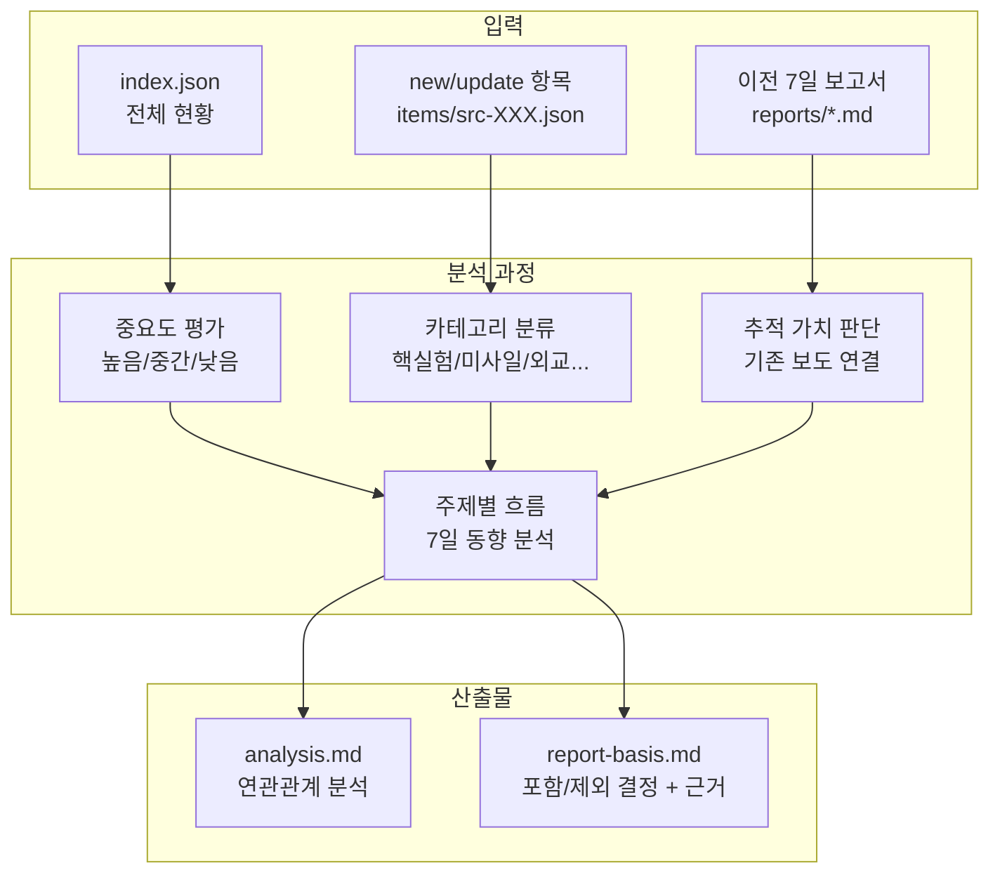
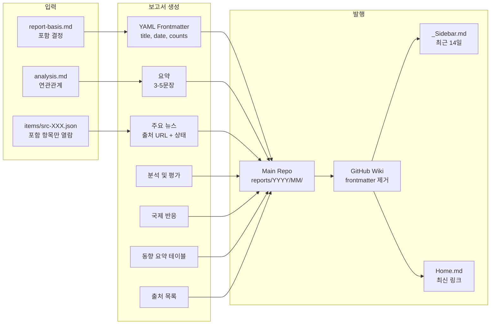
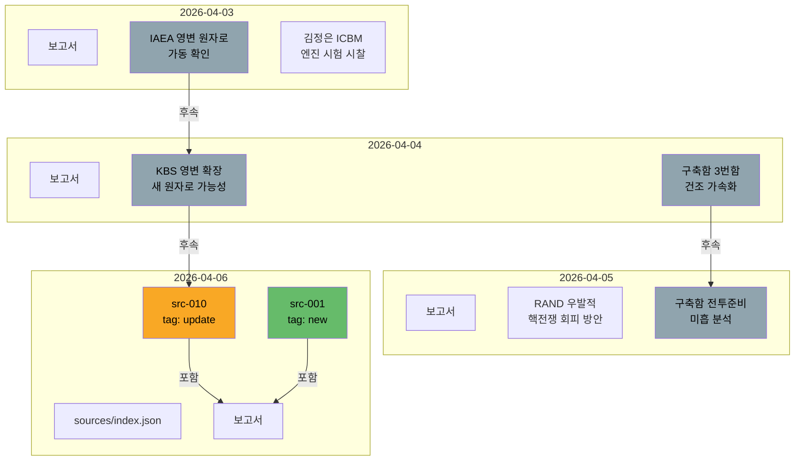

# North Korean Nuclear Activities Monitor

북한 핵활동에 대한 자동화된 일일 모니터링 및 보고서 생성 시스템.

GitHub Actions에서 Claude Code 에이전트가 매일 KST 08:00에 실행되어, 4단계 파이프라인(수집 → 태깅 → 분석 → 보고서)으로 추적 가능한 일일 보고서를 자동 생성합니다.

## 시스템 아키텍처



## 파이프라인 상세

4단계 파이프라인은 각 Phase의 산출물을 파일로 저장하여, 검색부터 보고서 작성까지 전 과정을 추적할 수 있습니다.



### Phase 1: 수집 (Collect)

다국어 웹검색으로 북한 핵활동 관련 뉴스를 수집합니다.



**산출물:** `sources/YYYY-MM-DD/search-results.json`

```json
{
  "date": "2026-04-06",
  "search_count": 24,
  "total_results": 68,
  "searches": [
    {
      "method": "websearch",
      "keyword": "북핵 최신 뉴스",
      "language": "ko",
      "results": [{ "title": "...", "url": "...", "snippet": "..." }]
    }
  ]
}
```

### Phase 2: 태깅 (Tag)

수집된 소스를 이전 7일 데이터와 비교하여 중복을 제거하고 상태를 태깅합니다.



**토큰 효율 설계:** 이전 소스 비교 시 `index.json`만 읽어 토큰 사용량을 ~90% 절감합니다.

| 파일 | 크기 | 용도 | 읽기 시점 |
|------|------|------|----------|
| `index.json` | ~9KB | id, title, url, tag만 포함 | 매일 (7일치 비교용) |
| `items/src-XXX.json` | ~600B 각 | snippet, tag_reason 등 상세 | 필요시만 선별 열람 |

**index.json 예시:**
```json
{
  "date": "2026-04-06",
  "total": 35, "new": 12, "reported": 19, "update": 4,
  "items": [
    { "id": "src-001", "title": "대북특사 여건 분석", "url": "https://...", "tag": "new", "related_report": null },
    { "id": "src-010", "title": "영변 핵시설 확장", "url": "https://...", "tag": "update", "related_report": "2026-04-04" }
  ]
}
```

**개별 소스 (items/src-001.json) 예시:**
```json
{
  "id": "src-001",
  "title": "대북특사, 한미 역할 분담 중요하지만…최근 여건 녹록지 않아",
  "url": "https://www.news1.kr/nk/politics-diplomacy/6126394",
  "snippet": "하노이 이후 북한 대남 강경 기조 유지...",
  "source_name": "뉴스1",
  "language": "ko",
  "tag": "new",
  "tag_reason": "이전 7일 소스에 대북특사 여건 분석 항목 없음"
}
```

### Phase 3: 분석 (Analyze)

태깅된 소스와 이전 보고서 간 연관관계를 분석하고, 보고서 작성 근거를 정리합니다.



**analysis.md** — 소스별 중요도, 카테고리, 이전 보고서 연관관계, 주제별 흐름 분석

**report-basis.md** — 포함/제외 결정 테이블과 보고서 구성 방향

```
## 포함 항목
| 소스 ID | 제목 | 태그 | 카테고리 | 포함 근거 |
|---------|------|------|----------|----------|
| src-001 | 대북특사 여건 분석 | new | 외교 | 한미 대북 정책 조율 관련 신규 분석 |
| src-010 | 영변 핵시설 확장 | update | 핵시설 | 04-04 IAEA 보고의 후속 위성 분석 |

## 제외 항목
| 소스 ID | 제목 | 제외 근거 |
|---------|------|----------|
| src-015 | 북한 미사일 우려 | 04-05 항목과 동일, 새 정보 없음 |
```

### Phase 4: 보고서 (Report)

분석 결과를 기반으로 최종 보고서를 생성하고 Wiki에 발행합니다.



## 연관관계 추적

이전 보고서와 오늘 소스 사이의 연결고리를 추적하여, 단발 뉴스가 아닌 연속적 동향을 파악합니다.



> **update** 항목(노란색)은 이전 보고서 항목과의 연결고리를 명시합니다:
> `상태: 업데이트 (← 2026-04-04 "KBS 영변 확장 새 원자로 가능성")`

## 디렉토리 구조

```
north-korean-nuclear-activities/
├── .claude/
│   ├── agents/                    # 에이전트 정의 (Phase별 역할)
│   │   ├── nk-collector.md        # Phase 1: 검색 수집
│   │   ├── nk-tagger.md           # Phase 2: 중복제거 + 태깅
│   │   ├── nk-analyst.md          # Phase 3: 연관관계 분석
│   │   └── nk-reporter.md         # Phase 4: 보고서 작성
│   └── skills/
│       └── nk-nuclear-report/
│           └── skill.md           # 파이프라인 오케스트레이터
│
├── .github/workflows/
│   └── daily-nk-nuclear-report.yml  # GitHub Actions 워크플로우
│
├── config/
│   └── search-sites.json          # Cheliped 검색 사이트 목록
│
├── sources/                       # 파이프라인 중간 산출물
│   └── YYYY-MM-DD/
│       ├── search-results.json    # Phase 1: 검색 원본
│       ├── index.json             # Phase 2: 경량 인덱스
│       ├── items/                 # Phase 2: 개별 소스 상세
│       │   ├── src-001.json
│       │   ├── src-002.json
│       │   └── ...
│       ├── analysis.md            # Phase 3: 연관관계 분석
│       └── report-basis.md        # Phase 3: 보고서 작성 근거
│
├── reports/                       # 최종 보고서
│   └── YYYY/MM/
│       └── YYYY-MM-DD.md
│
├── CLAUDE.md                      # 프로젝트 규칙 및 데이터 스키마
└── README.md
```

## 검색 키워드

| 언어 | 주요 키워드 |
|------|------------|
| 한국어 | 북핵, 북한 핵실험, 북한 미사일, 북한 핵무기, 북한 ICBM |
| English | North Korean nuclear, DPRK nuclear test, North Korea missile launch |
| 日本語 | 北朝鮮 核実験, 北朝鮮 ミサイル, 北朝鮮 核開発 |
| 中文 | 朝鲜核试验, 朝鲜核武器, 朝鲜导弹 |

## 검색 사이트 (`config/search-sites.json`)

| 유형 | 사이트 | 언어 |
|------|--------|------|
| 검색엔진 | Google, Naver, Bing, Baidu, Yahoo Japan, DuckDuckGo | 다국어 |
| 전문사이트 | 38 North, NK News, Reuters, 연합뉴스, NHK, Arms Control Association | 한/영/일 |

## 보고서 형식

```markdown
---
title: "YYYY-MM-DD 북한 핵활동 일일 보고서"
date: YYYY-MM-DD
sources_count: 35
new_items: 9
updated_items: 2
---

# 요약 (3-5문장)
# 주요 뉴스 (출처 URL, 상태: 신규/업데이트)
# 분석 및 평가
# 국제 반응
# 동향 요약 테이블
# 출처 목록
```

## 설정

### 필수 시크릿

| Secret | 설명 |
|--------|------|
| `CLAUDE_CODE_OAUTH_TOKEN` | Claude Code OAuth 토큰 |

### 설정 방법

1. GitHub repo → Settings → Secrets and variables → Actions
2. `CLAUDE_CODE_OAUTH_TOKEN` 시크릿 추가
3. Claude Code CLI에서 `/install-github-app` 실행하여 토큰 발급

### 수동 실행

Actions 탭 → "Daily NK Nuclear Activities Report" → "Run workflow" 클릭

특정 날짜 보고서: `target_date`에 `YYYY-MM-DD` 형식 입력

## 기술 스택

| 구성요소 | 기술 |
|----------|------|
| CI/CD | GitHub Actions |
| AI Agent | [Claude Code](https://claude.com/claude-code) via [claude-code-action](https://github.com/anthropics/claude-code-action) |
| 모델 | Claude Opus 4.6 |
| 웹검색 | WebSearch (빌트인) + [Cheliped Browser](https://github.com/tykimos/cheliped-browser) |
| Wiki | GitHub Wiki (자동 발행) |

## 라이선스

MIT License - [LICENSE](LICENSE) 참조
